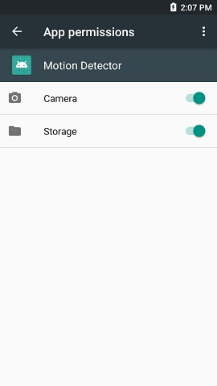

# Motion Detector Plug-in Sample for RICOH THETA

This sample plug-in detects moving objects using OpenCV library from the preview frame of RICOH THETA and shoots pictures.


## Set up
* Download this project using git close.
```
$ git clone https://github.com/theta-skunkworks/theta-plugin-opencv-detection-sample
```
* Import this project by Android Studio.
* Build the plug-in and install to the THETA.
* Set up app permissions manually after the installation using by [Vysor](https://www.vysor.io/).<br>
Enable the permission of "Camera" and "Storage".<br>



## Development Environment
### Camera
* RICOH THETA V Firmware ver.3.00.1
* RICOH THETA Z1 Firmware ver.1.03.5

### SDK/Library
* [RICOH THETA Plug-in SDK (ver.2.0.0)](https://github.com/ricohapi/theta-plugin-sdk)
* [OpenCV Android pack (ver.3.4.5)](https://opencv.org/releases.html)

### Development Software
* Android Studio ver.3.3+
* gradle ver.5.1.1

## For RICOH THETA Z1
In case of using RICOH THETA Z1, you need to modify some code.<br>
At the line 16-17 in `Constants.java`, you should modify the defines of still picture size to `6720x3360`.

```java:Constants.java
// still picture size
public static final int STILL_SIZE_WIDTH = 6720;
public static final int STILL_SIZE_HEIGHT = 3360;
```

## How to Use Plug-in
### How to start
* Set THETA on a stable position; ex) use tripod
* Press and hold "Mode" button several seconds until turn the LED white.

### During running
* THETA detects moving objects and shoots pictures.
* Taken pictures and detection window images are saved in THETA.

### How to end
* Press and hold "Mode" button several seconds until turn the LED blue.
* "MotionDetector" directory is created at DCIM, and you can see taken pictures and detection window images in this directory.


## License
```
Copyright 2018 Ricoh Company, Ltd.

Licensed under the Apache License, Version 2.0 (the "License");
you may not use this file except in compliance with the License.
You may obtain a copy of the License at

    http://www.apache.org/licenses/LICENSE-2.0

Unless required by applicable law or agreed to in writing, software
distributed under the License is distributed on an "AS IS" BASIS,
WITHOUT WARRANTIES OR CONDITIONS OF ANY KIND, either express or implied.
See the License for the specific language governing permissions and
limitations under the License.
```
